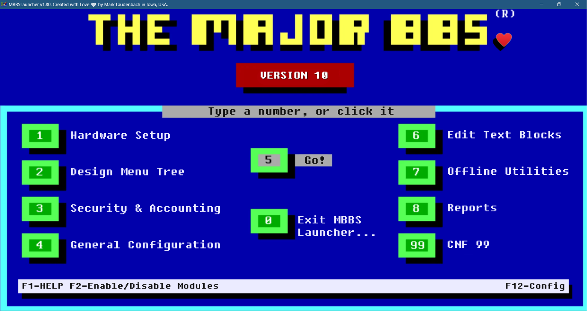

# MBBSLauncher

**Version:** v1.85 

[](LICENSE)

## Screenshot



## About

MBBSLauncher is a Windows application that provides easy access to tools and utilities for **The Major BBS Version 10** sysops. Inspired by the classic DOS-era Major BBS launcher interface, this modern version brings the nostalgic feel of the original while adding contemporary features and usability improvements.


---

## 🐛 Bug Disclosure

This was coded by a guy who Googles "how to exit vim" every single time. There WILL be bugs. There WILL be spelling mistakes. There WILL be profanity shouted at my monitor. You've been warned!

---

## Features

### Core Features
- **Retro DOS-Style Interface** — Classic blue screen design reminiscent of the original Major BBS v6.25 launcher
- **Easy Program Access** — Launch BBS utilities and tools with keyboard (0–9, 99) or mouse clicks
- **Configurable Menu** — Customize program paths and menu options via the F12 configuration editor
- **Smart Process Management** — Automatically detects if programs are already running and brings them to the foreground
- **WGServer Protection** — Prevents conflicts by detecting if the BBS server is already running
- **Auto-Hide/Show** — Launcher hides when programs run and reappears when they close
- **16:9 Aspect Ratio** — Modern scalable window while maintaining the classic look
- **INI Configuration** — Simple text-based configuration file for easy manual editing

### App Manager
- **Floating Status Window** — Real-time BBS and auto-launch program status with opacity slider
- **DPI-Aware Layout** — Scales correctly at 100%, 125%, 150%, and higher display scaling
- **Resizable** — Drag the bottom edge to resize; height persists between sessions
- **BBS Stop Delay** — Configurable delay before the launcher restores after the BBS stops (prevents popping up during cleanup scripts)

### Auto-Launch
- **Multiple Programs** — Launch up to 20 programs after the BBS starts, each with an independent delay timer
- **Already-Running Detection** — Skips auto-launch if the process is already running
- **Launch Minimized** — Programs can start minimized to prevent focus stealing
- **Ghost3 Support** — Dedicated auto-launch support for Ghost3 with countdown and cancel

### System
- **Self-Contained** — No .NET runtime installation required; everything is bundled in one exe (~65 MB)
- **Single Instance** — Prevents multiple launcher instances; restores the existing window if launched twice
- **Auto-Start** — Optional auto-start at Windows startup
- **Audit Log** — Diagnostic logs that auto-rotate at 500 KB
- **System Tray** — Minimize to tray with right-click context menu

---

## System Requirements

| Requirement | Details |
|---|---|
| **OS** | Windows 7 or later, Windows Server 2012 or later |
| **Architecture** | 32-bit (x86) — runs on both 32-bit and 64-bit Windows |
| **.NET Runtime** | **None required** — self-contained build |
| **Disk Space** | ~65 MB |
| **Permissions** | Administrator (UAC elevation prompt on launch) |

---

## Installation

1. Download `MBBSLauncher.exe` from the [Releases](https://github.com/SysopNetwork/MBBSLauncher/releases) page
2. Place it in your BBS directory or any folder of your choice
3. Run `MBBSLauncher.exe`
4. Click **Yes** when Windows asks for administrator permission

**That's it.** No .NET runtime installation needed. All dependencies are bundled in the single executable.

### Why Administrator Privileges?

MBBSLauncher requires administrator privileges to properly manage BBS processes, bring running applications to the foreground, and integrate with Windows startup. The UAC prompt on launch is normal and expected.

---

## Antivirus False Positives

Some antivirus software may flag MBBSLauncher as suspicious due to behaviors that are common in legitimate system utilities:

- **Process enumeration** — Checking if BBS programs are already running
- **Window manipulation** — Bringing running programs to the foreground
- **Launching executables** — Starting BBS utilities on your behalf
- **Startup integration** — Optional auto-launch at Windows startup

**This is a false positive.** The application is open source and completely safe.

### If Windows Defender Blocks the File

1. Open **Windows Security** → **Virus & threat protection** → **Manage settings**
2. Scroll to **Exclusions** → **Add or remove exclusions**
3. Click **Add an exclusion** → **Folder** → select the folder containing `MBBSLauncher.exe`

---

## Usage

### Keyboard Shortcuts

| Key | Action |
|---|---|
| **0–9, 99** | Launch the corresponding menu option |
| **Enter** | Launch the currently highlighted option |
| **Escape** | Exit or minimize to tray |
| **F1** | Open Help |
| **F2** | Enable/Disable Modules (WGSDMOD.exe) |
| **F12** | Open Configuration Editor |

### Default Menu Layout

| Option | Name | Program |
|---|---|---|
| 1 | Hardware Setup | WGSCNF.exe -L1 |
| 2 | Design Menu Tree | wgsrunmt.exe |
| 3 | Security & Accounting | WGSCNF.exe -L3 |
| 4 | General Configuration | WGSCNF.exe -L4 |
| 5 | **Go!** | wgsappgo.exe |
| 6 | Edit Text Blocks | WGSCNF.exe -L6 |
| 7 | Offline Utilities | WGSUMENU.exe |
| 8 | Reports | WGSRPT.exe |
| 99 | CNF 99 | WGSCNF.exe -L99 |
| 0 | Exit | — |

### First-Time Setup

On first launch, the application will:
1. Search for `BBSV10` and `WGSERV` folders on your system
2. Create a default `MBBSLauncher.ini` configuration file
3. Prompt you to configure program paths if not found automatically

Press **F12** to open the configuration editor at any time.

---

## Building from Source

### Prerequisites

- .NET 8.0 SDK
- Windows 10/11 (for building)
- Visual Studio 2022 (optional)

### Command Line

```powershell
git clone https://github.com/SysopNetwork/MBBSLauncher.git
cd MBBSLauncher/src/MBBSLauncher

dotnet restore
dotnet build -c Release

# Publish self-contained single-file exe
dotnet publish -c Release -r win-x86 --self-contained `
  -p:PublishSingleFile=true `
  -p:EnableCompressionInSingleFile=true `
  -p:IncludeNativeLibrariesForSelfExtract=true `
  -o "../../RELEASES/v1.85"
```

Output: `RELEASES/v1.85/MBBSLauncher.exe`

---

## Configuration File Format

`MBBSLauncher.ini` is created in the same directory as the executable on first run.

```ini
[Paths]
BBSPath=C:\BBSV10

[Window]
X=100
Y=100
Width=960
Height=540

[Settings]
AutoLaunchAtStartup=false
BBSStopDelay=0

[Programs]
Option1=C:\BBSV10\WGSCNF.exe -L1
Option1Name=Hardware Setup
Option5=C:\BBSV10\wgsappgo.exe
Option5Name=Go!
Option99=C:\BBSV10\WGSCNF.exe -L99
Option99Name=CNF 99

[AutoLaunch]
AutoLaunch1Name=Ghost3
AutoLaunch1Path=C:\Ghost3\Ghost3.exe
AutoLaunch1Delay=60
AutoLaunch1Enabled=true
```

---

## Version History

### v1.85 — Bug Fix Release
- Fixed double-launch restore failing when launcher is minimized to tray (single-instance window search is now version-agnostic)
- Fixed App Manager close button not cancelling a pending BBS stop delay, causing the launcher to restore unexpectedly
- Fixed Ghost3 and Auto-Start countdown banners overlapping when both are active simultaneously
- Fixed launcher not restoring after BBS stops when App Manager is hidden
- Fixed Module Editor background watcher not handling form disposal correctly
- Fixed cancel-button font leak in App Manager (GDI handle per BBS start/stop cycle)
- Fixed section divider lines not appearing in the F12 Configuration Editor
- Removed dead code (unused URL launcher method)

### v1.80
- **BBS Stop Delay** — Configurable delay before the launcher restores after the BBS stops; prevents the launcher from popping up during cleanup/restart sequences
- **Updated background image** — Removed outdated branding from the main screen
- **Sysop Network Discord** — Added Discord community link
- Various code quality improvements and bug fixes

### v1.70
- **App Manager** — Resizable floating status window with opacity slider, DPI-aware layout, and live countdown display
- Bug fixes: paint crash on close, BBS stop showing as "Crashed", countdown label truncation at high DPI

### v1.60
- Neutral BBS stop messaging throughout the UI
- Auto-Launch tab column width improvements
- Improved defaults for new installs

### v1.55
- Auto-Launch now skips programs that are already running

### v1.5
- Self-contained deployment — no .NET runtime required
- Single instance enforcement
- 5-tab configuration editor
- Multiple auto-launch programs with independent timers
- Automatic v1.20 configuration migration
- System tray integration

### v1.20
- Ghost3 auto-launch support with countdown and cancel
- Configurable Ghost3 path and delay

### v1.10
- System tray support with minimize-to-tray
- Auto-start with Windows

### v1.00
- Initial release — classic retro DOS-style interface

---

## Credits

- **Created by:** Mark Laudenbach
- **Inspired by:** The Major BBS v6.25 DOS Launcher by Galacticomm, Inc.
- **For:** The Major BBS and Worldgroup sysop community

---

## Support

- 💬 **Discord:** [Sysop Network](https://discord.gg/dpzquuNVmb)
- 🐛 **Issues:** [GitHub Issues](https://github.com/SysopNetwork/MBBSLauncher/issues)

---

## License

This project is licensed under the MIT License — see the [LICENSE](LICENSE) file for details.

---

*MBBSLauncher v1.85 — Created with Love in Iowa, USA. — © 2026 Mark Laudenbach*
