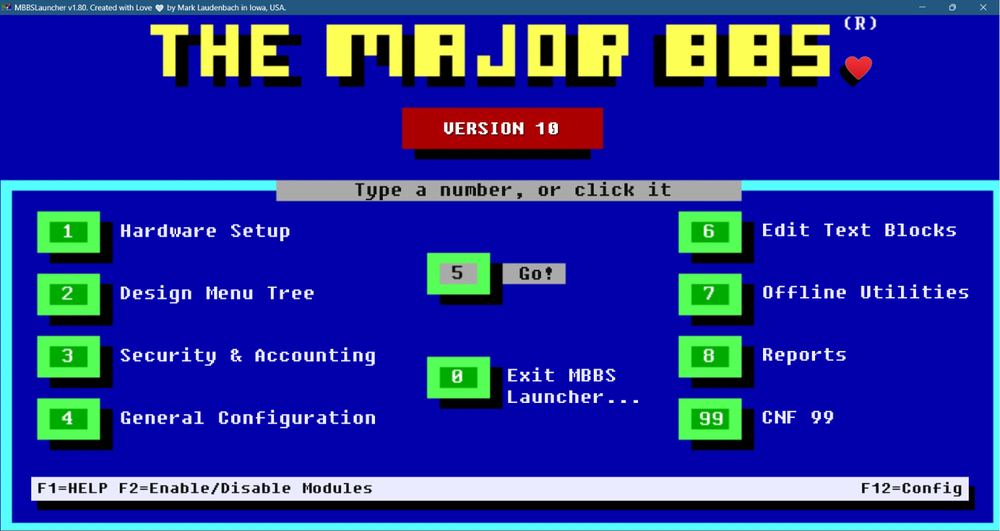

# MBBSLauncher

**Version:** v2.0

[](LICENSE)

## Screenshot



## About

MBBSLauncher is a Windows application that provides easy access to tools and utilities for **The Major BBS Version 10** sysops. Inspired by the classic DOS-era Major BBS launcher interface, this modern version brings the nostalgic feel of the original while adding contemporary features and usability improvements.

---

## 🐛 Bug Disclosure

This was coded by a guy who Googles "how to exit vim" every single time. There WILL be bugs. There WILL be spelling mistakes. There WILL be profanity shouted at my monitor. You've been warned!

---

## Features

### Core Features
- **Retro DOS-Style Interface** — Classic blue screen design reminiscent of the original Major BBS v6.25 launcher
- **Easy Program Access** — Launch BBS utilities and tools with keyboard (0–9, 99) or mouse clicks
- **Configurable Menu** — Customize program paths and menu options via the F12 configuration editor
- **Smart Process Management** — Automatically detects if programs are already running and brings them to the foreground
- **WGServer Protection** — Prevents conflicts by detecting if the BBS is already running, including mid-cleanup when the server is down but the `wgsappgo` supervisor is still alive
- **Auto-Hide/Show** — Launcher hides when programs run and reappears when they close
- **16:9 Aspect Ratio** — Modern scalable window while maintaining the classic look
- **INI Configuration** — Simple text-based configuration file for easy manual editing

### BBS Monitoring & Auto-Restart
- **Crash Detection** — Detects a BBS crash using the [TICKLER module](https://github.com/SysopNetwork/TICKLER) heartbeat file (present while running, removed on a clean shutdown), so a crash is reliably told apart from a normal shutdown or cleanup
- **Two-Stage Recovery** — Stage 1 restarts the BBS software (1–3 attempts); Stage 2 optionally reboots the computer once if restarts fail
- **Cancelable Countdowns** — Every restart attempt and the reboot show a cancelable countdown so the sysop can intervene at the console
- **Reboot-Loop Guard** — The one-shot reboot won't repeat until the BBS has run healthy again
- **Automatic Crash-Dialog Clearing** — A Windows memory-error box holding a faulted `wgserver.exe` open, or the supervisor's "Unrecognized errorlevel" box, is recognized and cleared automatically so recovery is never left waiting on a click
- **Fully Configurable** — Enable/disable each stage, attempt count, countdowns, and all timing knobs in the F12 → BBS Monitoring tab
- *Feature idea suggested by Steve Hartsock.*

### App Manager
- **Floating Status Window** — Real-time BBS and auto-launch program status with opacity slider
- **DPI-Aware Layout** — Scales correctly at 100%, 125%, 150%, and higher display scaling
- **Resizable** — Drag the bottom edge to resize; height persists between sessions
- **Cleanup-Aware** — Recognizes a BBS cleanup (the `wgsappgo` supervisor stays alive while `wgserver` restarts) and keeps the launcher hidden until a real shutdown, regardless of how long cleanup takes
- **Optional Auto-Popup** — Choose whether the App Manager opens by itself when the BBS starts; the tray icon can open it any time

### Auto-Launch
- **Multiple Programs** — Launch up to 20 programs after the BBS starts, each with an independent delay timer
- **Already-Running Detection** — Skips auto-launch if the process is already running
- **Launch Minimized** — Programs can start minimized to prevent focus stealing
- **3rd Party App Launcher** — Auto-launch a third-party program after the BBS starts, with countdown and cancel

### System
- **Self-Contained** — No .NET runtime installation required; everything is bundled in one exe (~65 MB)
- **Single Instance** — Prevents multiple launcher instances; restores the existing window if launched twice
- **Auto-Start** — Optional auto-start at Windows startup
- **Audit Log** — Diagnostic logs tagged with the build version, auto-rotating at 500 KB
- **Check for Updates** — Manual, on-demand check against the GitHub Releases page. The launcher never contacts GitHub on its own and never downloads or installs anything
- **System Tray** — Minimize to tray with right-click context menu

---

## System Requirements

| Requirement | Details |
|---|---|
| **OS** | Windows 7 or later, Windows Server 2012 or later |
| **Architecture** | 32-bit (x86) — runs on both 32-bit and 64-bit Windows |
| **.NET Runtime** | **None required** — self-contained build |
| **Disk Space** | ~65 MB |
| **Permissions** | Administrator (UAC elevation prompt on launch) |

---

## Installation

1. Download `MBBSLauncher.exe` from the [Releases](https://github.com/SysopNetwork/MBBSLauncher/releases) page
2. Place it in your BBS directory or any folder of your choice
3. Run `MBBSLauncher.exe`
4. Click **Yes** when Windows asks for administrator permission

**That's it.** No .NET runtime installation needed. All dependencies are bundled in the single executable.

### Why Administrator Privileges?

MBBSLauncher requires administrator privileges to properly manage BBS processes, bring running applications to the foreground, and integrate with Windows startup. The UAC prompt on launch is normal and expected.

---

## Antivirus False Positives

Some antivirus software may flag MBBSLauncher as suspicious due to behaviors that are common in legitimate system utilities:

- **Process enumeration** — Checking if BBS programs are already running
- **Window manipulation** — Bringing running programs to the foreground
- **Launching executables** — Starting BBS utilities on your behalf
- **Startup integration** — Optional auto-launch at Windows startup

**This is a false positive.** The application is open source and completely safe.

### If Windows Defender Blocks the File

1. Open **Windows Security** → **Virus & threat protection** → **Manage settings**
2. Scroll to **Exclusions** → **Add or remove exclusions**
3. Click **Add an exclusion** → **Folder** → select the folder containing `MBBSLauncher.exe`

---

## Usage

### Keyboard Shortcuts

| Key | Action |
|---|---|
| **0–9, 99** | Launch the corresponding menu option |
| **Enter** | Launch the currently highlighted option |
| **Escape** | Exit or minimize to tray |
| **F1** | Open Help |
| **F2** | Enable/Disable Modules (WGSDMOD.exe) |
| **F12** | Open Configuration Editor |

### Default Menu Layout

| Option | Name | Program |
|---|---|---|
| 1 | Hardware Setup | WGSCNF.exe -L1 |
| 2 | Design Menu Tree | wgsrunmt.exe |
| 3 | Security & Accounting | WGSCNF.exe -L3 |
| 4 | General Configuration | WGSCNF.exe -L4 |
| 5 | **Go!** | wgsappgo.exe |
| 6 | Edit Text Blocks | WGSCNF.exe -L6 |
| 7 | Offline Utilities | WGSUMENU.exe |
| 8 | Reports | WGSRPT.exe |
| 99 | CNF 99 | WGSCNF.exe -L99 |
| 0 | Exit | — |

### First-Time Setup

On first launch, the application will:
1. Search for `BBSV10` and `WGSERV` folders on your system
2. Create a default `MBBSLauncher.ini` configuration file
3. Prompt you to configure program paths if not found automatically

Press **F12** to open the configuration editor at any time.

### Setting Up BBS Monitoring

BBS Monitoring needs the [TICKLER module](https://github.com/SysopNetwork/TICKLER) (`SNTICKLR`) installed on the BBS so the launcher has a heartbeat to read. The module ships inside `MBBSLauncher.exe` — enabling BBS Monitoring in F12 → **BBS Monitoring** installs it into your BBS folder for you. The BBS must be stopped while monitoring is enabled or disabled.

---

## Building from Source

### Prerequisites

- .NET 8.0 SDK
- Windows 10/11 (for building)
- Visual Studio 2022 (optional)

### Command Line

```powershell
git clone https://github.com/SysopNetwork/MBBSLauncher.git
cd MBBSLauncher/src/MBBSLauncher

dotnet restore
dotnet build -c Release

# Publish self-contained single-file exe
dotnet publish -c Release -r win-x86 --self-contained `
  -p:PublishSingleFile=true `
  -p:EnableCompressionInSingleFile=true `
  -p:IncludeNativeLibrariesForSelfExtract=true `
  -o "../../RELEASES/v2.0"
```

Output: `RELEASES/v2.0/MBBSLauncher.exe`

---

## Configuration File Format

`MBBSLauncher.ini` is created in the same directory as the executable on first run.

```ini
[Paths]
BBSPath=C:\BBSV10

[Window]
X=100
Y=100
Width=960
Height=540

[Settings]
AutoLaunchAtStartup=false
BBSDownConfirmMs=1500
BBSRetractWindowSec=15

[Programs]
Option1=C:\BBSV10\WGSCNF.exe -L1
Option1Name=Hardware Setup
Option5=C:\BBSV10\wgsappgo.exe
Option5Name=Go!
Option99=C:\BBSV10\WGSCNF.exe -L99
Option99Name=CNF 99

[AutoLaunch]
AutoLaunch1Name=Door Server
AutoLaunch1Path=C:\YourApp\YourApp.exe
AutoLaunch1Delay=60
AutoLaunch1Enabled=true
```

### Timing Settings Worth Knowing

| Key | Default | What it does |
|---|---|---|
| `BBSDownConfirmMs` | `1500` | How long `wgserver` **and** `wgsappgo` must both be gone before the launcher treats it as a shutdown. Raise it if a cleanup on your board makes the launcher flash up. Range 500–30000. |
| `BBSRetractWindowSec` | `15` | How long to watch for the BBS coming back after a restore. If it does, the launcher hides again and logs the elapsed time under `BBS.Retract` in `audit.log` — that number is the `BBSDownConfirmMs` value your board needs. `0` disables. Range 0–120. |

---

## Version History

### v2.0 — BBS Monitoring

- **BBS Monitoring & Auto-Restart** — Detects a BBS crash via the [TICKLER module](https://github.com/SysopNetwork/TICKLER) heartbeat and recovers it: Stage 1 restarts the BBS software (1–3 attempts), Stage 2 optionally reboots the machine once. Cancelable countdowns, reboot-loop guard, configurable timings, and a BBS Monitoring configuration tab. Idea suggested by Steve Hartsock.
- **Automatic crash-dialog clearing** — The memory-error box that holds a faulted `wgserver.exe` open, and the supervisor's "Unrecognized errorlevel" box, are cleared automatically so crash recovery is never blocked waiting on a click.
- **Check for Updates** — Manual, on-demand check against the GitHub Releases page (F12 → Advanced).
- **Faster restore after a BBS shutdown** — The launcher reappears in about 2 seconds instead of 6–8, with a retract watch that puts it away again if the BBS turns out to have been cleaning up.
- **Cleanup safety** — A cleanup is no longer mistaken for a crash, no longer shows "Crashed" in the App Manager, and no longer pops the launcher up with monitoring off.
- **Pressing Go! during a cleanup no longer starts a second BBS.**
- **App Manager auto-popup is now optional**, and `audit.log` tags every line with the build version.

Full detail is in [CHANGELOG.md](CHANGELOG.md). Release history for v1.x is archived with the [v1.85 release](https://github.com/SysopNetwork/MBBSLauncher/releases/tag/v1.85).

---

## Credits

- **Created by:** Mark Laudenbach
- **Inspired by:** The Major BBS v6.25 DOS Launcher by Galacticomm, Inc.
- **For:** The Major BBS and Worldgroup sysop community

---

## Support

- 💬 **Discord:** [Sysop Network](https://discord.gg/ByM7Dm6bXY)
- 🐛 **Issues:** [GitHub Issues](https://github.com/SysopNetwork/MBBSLauncher/issues)

---

## License

This project is licensed under the MIT License — see the [LICENSE](LICENSE) file for details.

---

*MBBSLauncher v2.0 — Created with Love in Iowa, USA. — © 2026 Mark Laudenbach*
